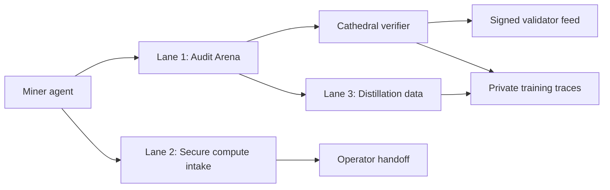

# Cathedral v0 Lanes

Status: reviewable vertical slice. Local/offline by default. No Polaris spend.

The v0 product shape is three lanes with one shared standard: miners and agents
do useful work only when Cathedral can verify the result deterministically.

Launch scorecard: `LAUNCH_SCORECARD.md`.
Current local scaffold score: 91 / 100. The missing points require real TEE GPU
verifier/provider/revenue evidence.
If that machine is not available, launch under `no-hardware-v0`: Audit Arena and
distillation scaffolds can move forward, while Secure Compute runs only as
gated live intake until real evidence exists.

## Architecture



## Lane 1: Bittensor Audit Arena

The live SAT board is fed by Cathedral's refill generator when
`CATHEDRAL_REFILL_ENABLED=true`. The launch profile keeps 25 tier-1 and 25
tier-2 active challenges, with tier 1 as the biased participation floor and
tier 2 as the AJM SAT differentiator. The board exposes this under
`generator`, `scoring`, and `distribution` so miners can see what is live.
External SAT generator leasing is wired but default-disabled; do not describe it
as live unless `CATHEDRAL_SAT_GENERATOR_ENABLED`, URL, and token are configured
and deployed smoke passes.

Chant:

> Cathedral miners do not claim bugs. They produce witnesses. Cathedral replays
> them against pinned target logic before anyone gets credit.

The v0 code path is in `scaffold/lanes/audit_arena.py`.

It proves this sequence:

1. Operator pins a target repo, commit, invariant, CNF, and decode map.
2. Miner submits a DIMACS satisfying assignment.
3. Cathedral verifies the assignment against the exact CNF.
4. Cathedral decodes the assignment into target inputs.
5. A deterministic replay function checks whether the target behavior moves.
6. The accepted/rejected result becomes a private distillation trace.

Known-answer corpus entries may use a static decoded witness only when the task
is marked as `replay_kind="corpus_smoke"` or `"known_answer_smoke"` and the
decode map explicitly sets `allow_static_witness=true`. Production audit CNFs
must use bit projections so replay inputs are bound to the miner's assignment,
and must declare a non-empty `required_fields` list. Sparse maps are allowed only
for explicitly marked corpus/smoke tasks. Maps that only list input names with
`decode_inputs` are rejected.

Important launch rule: live third-party exploitation is not part of this v0
verifier. This lane supports shadow replay, Cathedral-owned canaries, opt-in live
tests, and normal rule-compliant competition. The proof artifact is replayable
economic impact, not an unverifiable report. Production promotion requires a
pinned target commit, exact CNF hash, full replay-field binding, deterministic
replay adapter identity, private trace hash, and operator review before any
public disclosure or live earning experiment.

Smoke gate:

```bash
python3 audit_arena_verify.py
python3 attest_verify.py
python3 arena_runner_verify.py
python3 launch_readiness_verify.py
```

On Windows, use WSL `python3`, `py` if installed, or the Codex bundled Python
path if the plain `python` command resolves to the Microsoft Store alias.

## Lane 2: Secure Compute Intake

Detailed plan: `LANE2_SECURE_COMPUTE_PLAN.md`.
Solver-attestation status: `SOLVER_ATTESTATION_STATUS.md`.

The current compute path is publisher-only and default-off. Core routes include:

- `POST /v1/tee-gpu/offers`
- `GET /v1/tee-gpu/offers`
- `POST /v1/tee-gpu/evidence-request`
- `POST /v1/admin/tee-gpu/capacity`
- `PATCH /v1/admin/tee-gpu/capacity/{capacity_id}`
- `POST /v1/admin/tee-gpu/capacity/{capacity_id}/attestation-review`
- `POST /v1/admin/tee-gpu/capacity/{capacity_id}/verify-evidence`
- `POST /v1/admin/tee-gpu/capacity/{capacity_id}/provider-status`
- `POST /v1/admin/tee-gpu/capacity/{capacity_id}/health-receipt`
- `POST /v1/admin/tee-gpu/capacity/{capacity_id}/usage-receipt`
- `GET /v1/admin/tee-gpu/chutes-manifest`
- `POST /v1/admin/tee-gpu/capacity/{capacity_id}/chutes-list`

Guardrails already present:

- no writes to `eval_runs`, `lane_challenge_solves`, or `per_miner_solves`
- signed miner capacity offers
- invite-code or hotkey-allowlist gate for live miner entry
- explicit operator-use authorization
- Chutes TEE profile preflight for 8x `h200`, `pro_6000`, `b200`, or `b300`
- admin approval before listing
- operator-reviewed lab evidence status
- verifier-created `cryptographically_verified` evidence status
- provider, health, and usage/revenue receipts before production readiness
- execution disabled unless `CATHEDRAL_TEE_GPU_CHUTES_EXECUTE_ENABLED=1`

Launch recommendation:

```bash
CATHEDRAL_TEE_GPU_ENABLED=1
CATHEDRAL_TEE_GPU_ADMIN_TOKEN=<long random token>
CATHEDRAL_TEE_GPU_REQUIRE_INTAKE_CODE=1
CATHEDRAL_TEE_GPU_INTAKE_CODE=<shared invite code>
# or: CATHEDRAL_TEE_GPU_INTAKE_ALLOWLIST=5HotkeyA,5HotkeyB
CATHEDRAL_TEE_GPU_REQUIRE_EVIDENCE=1
CATHEDRAL_TEE_GPU_REQUIRE_CRYPTO_EVIDENCE=1
CATHEDRAL_TEE_GPU_VERIFY_CMD="<tdx-and-nvidia-gpu-verifier-command>"
CATHEDRAL_TEE_GPU_REAL_VERIFIER_DIGESTS="<sha256-of-approved-verifier-command>"
```

Treat preflight as necessary but not sufficient. A self-reported GPU, TDX claim,
or screenshot is not proof of usable confidential compute. Before miners are
asked to buy hardware, the source of truth is cryptographically verified fresh
attestation evidence, provider acceptance, health checks, and revenue receipts.
Without that first real proof machine, this lane should accept only signed
offers from invited or allowlisted miners plus operator review. Do not emit
revenue-ready copy or broad purchasing instructions.

Smoke gate:

```bash
python tee_gpu_verify.py
python launch_readiness_verify.py
```

## Lane 3: Distillation

Distillation begins with verifier traces, not vibes.

The v0 audit trace schema is emitted by `build_distillation_trace()`:

- target repo and commit
- invariant
- challenge hash
- miner hotkey
- solution hash
- decoded witness
- replay result
- accepted/rejected label
- live earning policy
- stable trace hash

This gives Cathedral training data for agents that can:

- map validator and scoring code
- choose an invariant
- generate or select a witness
- reproduce locally
- write a useful patch/disclosure

The initial dataset should be private. Public outputs should be redacted unless
the target owner has opted in or the issue is already fixed.

Redaction/export gate: `scaffold/distillation.py`.

- private exports hash miner identity and omit raw agent/witness content by default
- public exports require fixed/public/opt-in/Cathedral-owned disclosure status
- public exports require a long random redaction salt or server-side HMAC secret
- public exports strip repo URL, commit, netuid, raw witness, and agent trace

## Launch Checklist

- Audit Arena smoke test passes.
- TEE GPU smoke test passes.
- Launch readiness scorecard smoke test passes.
- Publisher verifies still pass if the publisher extra is installed.
- No Polaris resources are rented during local validation.
- No live validator endpoint is changed.
- Compute lane remains default-off.
- Chutes execution remains disabled unless explicitly enabled by an operator.
- Audit traces are private by default.
- Every accepted audit witness has deterministic replay evidence.
- Every rejected audit claim includes a reason.
- Distillation public export is redaction-gated.

## Risk Register

| Risk | Why it matters | Mitigation |
|---|---|---|
| Fake audit claims | Agents can hallucinate reports | Score only verified witnesses plus replay |
| Sparse decode maps | A SAT assignment may not become human inputs | Require `required_fields` plus bit projection for production audit CNFs |
| Dust findings | True but useless bugs can pollute the brand | Severity and reachability gate before disclosure |
| Unauthorized live extraction | Legal and reputational risk | Use replay, canaries, opt-in tests, or normal competition |
| Fake TEE/GPU supply | Miners can spoof hardware claims | Require evidence and provider acceptance before revenue ops |
| Polaris spend | Live validator and credits are precious | Prefer local/Stitch/Lilo; rent only with explicit need |
| Training-data leakage | Exploit traces are sensitive | Private traces by default, redacted public summaries, public disclosure gate |

## Next Implementation Slice

1. Add operator-only audit package intake: CNF + manifest + decode map.
2. Persist verified SAT assignments for audit-tagged challenges.
3. Add a private endpoint/export for decoded audit witnesses.
4. Add replay adapters for the top Bittensor candidate classes.
5. Add an attested replay runner once the offline verifier is stable.
6. Promote high-quality accepted traces into the distillation corpus.
