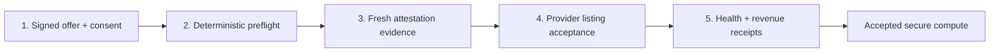
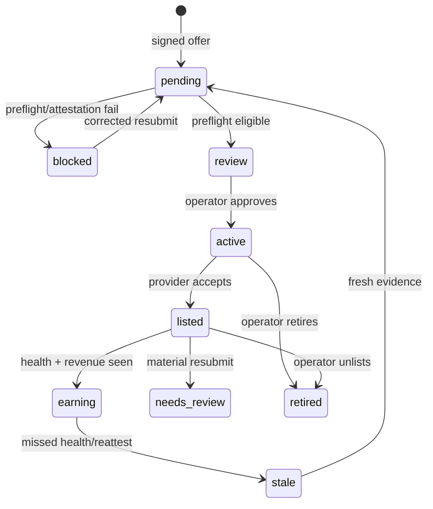

# Lane 2: Secure Compute Supply

Status: plan from prior Polaris solver-attestation work plus the current
`tee_gpu` publisher lane. This is the launch path for:

> Miners list authorized secure compute with Cathedral. Cathedral verifies the
> machine, lists approved capacity through the operator control plane, and tracks
> revenue evidence. No validator update required for v0.

## What The Prior Solver Attestation Work Proved

The relevant artifacts are the solver-attestation design in
`C:\Users\fred\code\cathedral-scaffold\ATTESTATION.md`, the deeper receipt-lane
review in `C:\Users\fred\code\cathedral-scaffold\RECEIPT-LANE-SPEC.md`, the
active verifier seam in `scaffold/publisher/attest.py`, and the solver lane
prototype in `scaffold/lanes/solver_docker.py`.

Important current-state correction:

> The solver-attestation pieces are not complete as an end-to-end live publisher
> API yet. The active publisher now exposes default-off `/v1/attest/nonce`,
> `/v1/attest`, and `/v1/attest/status/{eval_run_id}` routes, but real DCAP
> verification and the production arena runner require explicit operator env
> commands. With no verifier configured, verify fails closed.

The important part is the Route B attestation recipe:

- a GCP Intel TDX box produces a raw TDX quote
- `report_data[0:32] = sha256(nonce || e2e_pubkey_b64)`
- `report_data[32:64] = sha256(bound_digest || result_sha256)`
- `bound_digest` is the box-computed Docker image content digest, or script hash
- `result_sha256` is the box-computed hash of the actual stdout returned
- Intel collateral is captured so a verifier can check the quote offline
- client-side verification recomputes both halves and checks quote bytes

Plain English, once the verifier is actually wired:

> Route B can prove this attested TDX box ran this image/script and produced
> this result, bound to a verifier nonce.

The do-not-overclaim line:

> Route B does not make the image the MRTD. The base VM measurement is fixed.
> Image-as-MRTD is Route A, a separate measured-launch project.

Route A was planned, not built. It would put the workload image into an early
boot measurement or make the whole image the measured guest. That is stronger,
slower, and more expensive. Lane 2 v0 should not depend on Route A.

## Current Cathedral State

The active repo already has a default-off secure-compute intake:

- `scaffold/publisher/tee_gpu.py`
- `tee_gpu_verify.py`
- `TEE_GPU_CAPACITY.md`

What it already does well:

- signed miner offers
- explicit operator-use authorization
- admin review before activation
- no writes to validator scoring tables
- Chutes handoff manifest and dry-run/execute split
- material resubmits demote active capacity back to pending
- blocked rows do not emit listing commands
- current preflight accepts only published TEE measurement shapes:
  - `8x h200`
  - `8x pro_6000`
  - `8x b200`
  - `8x b300`

What it does not yet prove unless the production verifier is configured:

- the TDX quote is genuine
- the quote is fresh and nonce-bound
- the GPU evidence is genuine NVIDIA confidential-compute evidence
- the machine is bare metal rather than a managed pod/proxy
- the node is actually accepted by the provider
- the node is still live after listing
- revenue was actually earned

The current preflight has two modes:

- lab mode: operator-reviewed evidence can pass `CATHEDRAL_TEE_GPU_REQUIRE_EVIDENCE=1`
- production hardware mode: only verifier-created `cryptographically_verified`
  evidence can pass `CATHEDRAL_TEE_GPU_REQUIRE_CRYPTO_EVIDENCE=1`
- gated live intake mode: miner entry requires either an operator-provided
  intake code or an allowlisted hotkey

The production hardware mode is the only acceptable posture before asking
miners to buy expensive machines.

## Lane 2 Product Shape

Lane 2 has five gates. A miner does not pass because they claim hardware. They
pass because each gate leaves evidence.

The v0 earning model should be off-chain revenue share, not validator emissions.
That keeps lane 2 launchable without asking validators to upgrade.

## Acceptance Gates

### Gate 1: Signed Offer And Consent

Already mostly built.

Required:

- hotkey-signed offer
- stable `node_id`
- GPU short ref and count
- hourly cost
- worker `agent_api`
- explicit operator-use authorization

Reject if:

- no signature
- no consent
- malformed price
- material resubmit after approval without fresh review

### Gate 2: Deterministic Preflight

Already mostly built.

Required:

- GPU short ref is provider-supported
- GPU shape matches the current TEE measurement profile
- `agent_api` points at the worker agent, normally `:32000`
- TDX and GPU confidential-compute are claimed

Reject if:

- unsupported GPU
- wrong GPU count
- non-TEE profile
- missing consent
- non-HTTP worker API

### Gate 3: Verified Attestation Evidence

This is the launch-critical gate.

Add an evidence-request flow:

- `POST /v1/tee-gpu/evidence-request`
- request id bound to `(owner_hotkey, node_id)` for operator review context
- request issuance is stored in the capacity event log
- this is not a single-use verifier nonce and not cryptographic proof

Extend the offer/admin evidence with:

- `tdx_quote_b64`
- `collateral_b64` or `collateral_json`
- `gpu_evidence_b64` or provider GPU evidence JSON
- `evidence_request_id`
- parsed quote fields:
  - `tee_type`
  - `mrtd`
  - `rtmr0..3`
  - `report_data`

Current rules:

- miner-provided Cathedral review fields are stripped
- submitted evidence without an evidence request remains review-required
- `operator_reviewed` requires actual evidence fields plus an evidence request id
- rejected evidence always blocks preflight
- `CATHEDRAL_TEE_GPU_REQUIRE_EVIDENCE=1` fails closed unless evidence is operator-reviewed
- `CATHEDRAL_TEE_GPU_REQUIRE_CRYPTO_EVIDENCE=1` fails closed unless evidence is
  `cryptographically_verified`
- only `POST /v1/admin/tee-gpu/capacity/{capacity_id}/verify-evidence` can create
  `cryptographically_verified`
- manual `attestation-review` cannot set `cryptographically_verified`
- no route claims production acceptance unless `CATHEDRAL_TEE_GPU_VERIFY_CMD` is configured

Production verifier rules:

- quote parses as TDX v4/1.5
- `tee_type` family is Intel TDX, not AMD SEV/SNP
- quote is Intel-verified through DCAP or delegated attestor
- verifier nonce matches `report_data[0:32]`
- quote is not stale
- Chutes/published measurement profile matches `MRTD/RTMR`
- GPU evidence says confidential-compute mode is on
- claimed GPU model/count matches evidence
- debug mode is disabled
- verifier output must explicitly report:
  - TDX quote verified
  - NVIDIA GPU attestation verified
  - Cathedral request/report binding matched
  - debug disabled

Important distinction:

- For Route B workload attestation, image identity rides in `report_data[32:64]`.
- For lane 2 capacity admission, host identity matters, so `MRTD/RTMR` matching
  published provider measurements is important.

### Gate 4: Provider Listing Acceptance

Already partly built as a handoff.

Required:

- active Cathedral capacity row
- provider server name
- hotkey path configured on the operator side
- exact generated `chutes-miner add-node` command or API call
- captured stdout/stderr and return code
- provider server id/status stored back on the row

Reject/block if:

- pending/rejected/retired status
- preflight blocked
- attestation failed
- no operator consent
- missing operator hotkey path
- provider CLI/API fails

### Gate 5: Health And Revenue Evidence

This is what turns "listed" into "useful compute."

Required:

- periodic worker health probe
- provider inventory import
- provider status is active/listed
- revenue/usage receipt or accepted workload evidence
- stale or missing health demotes to paused/expired

Do not pay/share revenue from Cathedral records alone. The source of truth is:

- operator-reviewed evidence in the current slice
- fresh verified attestation after Phase 2
- provider acceptance
- liveness
- actual usage/revenue receipt

## State Machine

Current repo states are simpler: `pending`, `active`, `paused`, `rejected`,
`retired`. That is fine for v0. Add provider/attestation sub-statuses before
adding more top-level states.

## Implementation Plan

### Phase 0: Keep The Current Lane Safe

Done or mostly done.

- keep `CATHEDRAL_TEE_GPU_ENABLED` default off
- keep execution disabled unless explicitly enabled
- keep no emissions writes
- keep blocked/non-consented rows from emitting commands
- keep the existing `tee_gpu_verify.py` smoke gate

### Phase 1: Evidence Request And Review

Current lab vertical slice. Add structured evidence status without changing
validator behavior or adding schema:

- signed miner `POST /v1/tee-gpu/evidence-request`
- event-log evidence request record
- miner/admin evidence summaries
- admin-only `attestation-review` endpoint
- fail-closed `CATHEDRAL_TEE_GPU_REQUIRE_EVIDENCE=1`
- tests proving fake miner review fields do not pass

This is additive and default-safe, but it is not enough for a production
hardware purchasing ask.

### Phase 2: Production Evidence Verification

Current production slice in this branch:

- `CATHEDRAL_TEE_GPU_VERIFY_CMD=<verifier-command>`
- `CATHEDRAL_TEE_GPU_REQUIRE_CRYPTO_EVIDENCE=1`
- admin-only `POST /v1/admin/tee-gpu/capacity/{capacity_id}/verify-evidence`
- verifier receives:
  - `evidence.json`
  - `request.json`
  - `capacity.json`
  - `result.json`
- optional placeholders:
  - `{evidence_path}`
  - `{request_path}`
  - `{capacity_path}`
  - `{result_path}`
- verifier result must include `ok` or `verified`, plus checks for TDX, GPU,
  claimed GPU model/count, request/report binding, and debug-disabled state
- successful verification stores `cryptographically_verified`
- failed or missing verification keeps preflight blocked

This is the minimum code path needed before telling miners what hardware to buy.

### Phase 3: Real Nonce + Quote Verification Details

Add:

- verifier nonce table with expiry and single-use state
- consumed nonce checks during evidence verification
- TDX quote parser reuse from `cathedral-horde/confidential_compute/tdx.py`
- verifier seam:
  - `stub` for tests only, fail-closed in live mode
  - `attestor_delegate` to Polaris attestor
  - later: in-process `dcap-qvl`

Fail closed when live and no verifier is configured.

### Phase 4: GPU Evidence Verification Details

Add a narrow GPU evidence parser:

- accept NVIDIA confidential-compute evidence format used by provider
- reject AMD GPU evidence for the first lane
- reject normal `nvidia-smi` output as proof
- store parsed GPU model/count/cc-mode

This is the hard part to get exact. Until it is exact, use it as "needs review,"
not automatic acceptance.

### Phase 5: Provider Inventory Loop

Add an operator-only importer:

- pull/list provider inventory
- reconcile `chutes_server_id`
- update `chutes_status`
- detect listed-but-missing, active-but-not-listed, stale/failed nodes

This closes the gap where Cathedral lists a row once but never knows whether the
provider still has it.

Current receipt surface:

- `POST /v1/admin/tee-gpu/capacity/{capacity_id}/provider-status`
- requires `cryptographically_verified` evidence and eligible preflight
- records accepted provider status, provider server id/name, receipt id, and raw
  digest in the event log
- exposes `launch_evidence.provider_listing_verified`

### Phase 6: Health + Revenue Loop

Add periodic probes:

- worker `agent_api` health
- provider status
- usage/revenue receipts
- re-attestation age

Demote when stale. Surface "earning" only when provider and health agree.

Current receipt surface:

- `POST /v1/admin/tee-gpu/capacity/{capacity_id}/health-receipt`
- `POST /v1/admin/tee-gpu/capacity/{capacity_id}/usage-receipt`
- usage receipt requires provider listing and health receipt first
- exposes `launch_evidence.health_verified`,
  `launch_evidence.usage_or_revenue_verified`, and
  `launch_evidence.production_compute_ready`

## Production Hardware Ask Gate

Do not ask miners to buy production machines until all of these are true:

- live intake is gated by `CATHEDRAL_TEE_GPU_REQUIRE_INTAKE_CODE=1` plus an
  invite code or hotkey allowlist
- `CATHEDRAL_TEE_GPU_REQUIRE_CRYPTO_EVIDENCE=1` is enabled in the intake
- `CATHEDRAL_TEE_GPU_VERIFY_CMD` is installed and tested against a real machine
- one real 8-GPU TEE node completes:
  - signed offer
  - fresh evidence request
  - TDX quote verification
  - NVIDIA GPU confidential-compute verification
  - preflight eligibility as `cryptographically_verified`
  - provider listing acceptance recorded via `provider-status`
  - health check recorded via `health-receipt`
  - usage or revenue receipt recorded via `usage-receipt`
- Cathedral explicitly announces that hardware purchasing is open. Until then,
  the candidate profile list below is not a purchase instruction.
- the accepted purchasing list is exact and narrow:
  - 8x H200
  - 8x B200
  - 8x B300
  - 8x RTX Pro 6000, only if the provider measurement path is confirmed live
- explicitly reject:
  - A6000
  - AMD GPUs
  - CPU-only TEE
  - non-TEE H100/A100/4090-style machines
  - any single-GPU shape unless the upstream provider publishes and accepts that
    exact TEE measurement profile

### Phase 7: Miner UX

Add:

- miner-facing status endpoint
- admin dashboard filters:
  - ready to review
  - attestation failed
  - ready to list
  - listed
  - stale
  - earning
- clear rejection reasons miners can act on

## What Not To Build Yet

- Do not make lane 2 a validator emissions lane yet.
- Do not accept self-reported GPU data as proof.
- Do not ask miners to buy hardware until the accepted profile is exact.
- Do not claim image-as-MRTD; Route A is not built.
- Do not rely on screenshots, `nvidia-smi`, cloud metadata, or benchmark stdout.
- Do not list one-off odd shapes unless provider measurements actually support them.

## Launch Criteria

Lane 2 is operator-launch-ready when:

- a miner can submit a signed, consented offer
- Cathedral rejects obvious fake/non-TEE profiles
- operator can approve only eligible capacity
- operator can dry-run and execute the provider listing handoff
- provider status is imported back into Cathedral
- stale capacity can be paused/retired
- tests show no rows touch validator scoring tables
- attestation evidence is stored and manually reviewable for lab mode
- before public hardware asks: at least one real accepted machine reaches
  `cryptographically_verified` and passes the full evidence -> listing -> health
  -> revenue loop

## Near-Term Recommendation

Use the current lane for a small controlled batch only:

- accept the provider-published 8x profiles first
- process in batches of 8 machines at most
- require explicit consent
- require operator approval
- require provider acceptance before calling it useful
- require cryptographic evidence before telling miners to buy hardware

The first code PR should not be emissions. It should be:

1. evidence schema,
2. operator-reviewed evidence request/status for lab mode,
3. production verifier handoff that can create `cryptographically_verified`,
4. real nonce + TDX/GPU verifier integration,
5. provider inventory import,
6. dashboard/status cleanup.
