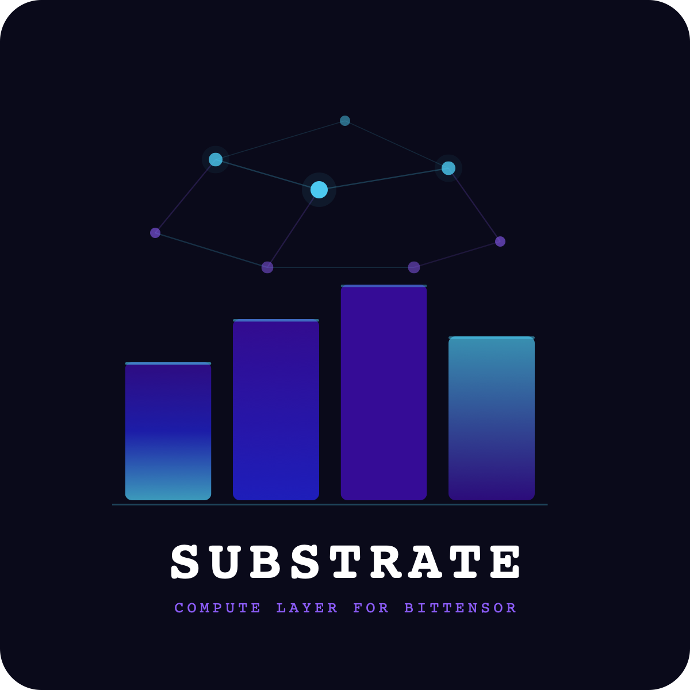

  

# 
Cathedral

  <em>A cathedral is built slowly, by many hands, over long time.</em>

  <a href="https://cathedral.computer">cathedral.computer</a>

---

## Status

- **Validator:** running on mainnet SN39 (UID 123) and testnet SN292 (UID 32)
- **Miners verified:** 2 on mainnet (UID 115 RTX 5090, UID 155 RTX 3090 + 2× 3060), 1 on testnet (UID 33 AMD EPYC CPU)
- **Weights:** parked on mainnet — below the permit stake threshold, compute units accrue against the ledger
- **Act 1: Baseline stability** — validator + miners end-to-end, external masons onboarding

Live dashboard: [cathedral.computer](https://cathedral.computer) — block, stake, miners, weights, updated every 10s.

It is recommended not to stake to SN39 at this time. See [docs/policy.md](docs/policy.md).

## What Cathedral is

A compute subnet on Bittensor. Miners — the masons — bring hardware and raise it into the wall. Validators — the master masons — inspect each stone: is it real, does it hold, is it the GPU (or CPU) it claims to be. Applications consume the compute that emerges from the cathedral.

Forked from [Basilica](https://github.com/one-covenant/basilica) under MIT. The code survived. Cathedral carries it forward on home-ownable hardware instead of data-center SKUs.

## Lay a stone

Start on testnet with free test TAO — the apprentice yard. When your setup holds, step into mainnet.

- Narrative onboarding (start here): [cathedral.computer/afrotensor](https://cathedral.computer/afrotensor)
- Technical reference: [cathedral.computer/mine](https://cathedral.computer/mine)
- Long-form walkthrough: [docs/miner.md](docs/miner.md)

Minimum: a machine with SSH access, reachable from the validator. A laptop, a cheap VPS, a gaming PC in a bedroom — all acceptable stones.

## Networks

- **Mainnet:** Bittensor finney · SN39 · `wss://entrypoint-finney.opentensor.ai:443`
- **Testnet:** Bittensor test · SN292 · `wss://test.finney.opentensor.ai:443`

## Supported hardware

| Class | Examples | Slug | Floor $/hr |
|---|---|---|---|
| Consumer GPU | RTX 3060–5090, Apple Silicon, DGX Spark | `RTX_*`, `APPLE_*`, `NVIDIA_DGX_SPARK` | $0.08 – $1.30 |
| Workstation | RTX 6000 Ada, W7900, Pro 6000 Blackwell | `RTX_6000_ADA`, `W7900`, `RTX_PRO_6000_BLACKWELL` | $0.75 – $1.30 |
| CPU | Any Linux box with SSH | `CPU_BASIC`, `CPU_STANDARD`, `CPU_PERFORMANCE` | $0.02 – $0.08 / vCPU-hr |

Data-center SKUs (A100, H100, H200, MI300, etc.) are rejected at registration. The cathedral is built from stones a person can lay.

## Roadmap

- **Act 1** — Baseline stability. End-to-end validator + miners. External masons on-boarding. *Now.*
- **Act 2** — Profitability. Miners earn real emissions. Compute economics proven.
- **Act 3** — Ecosystem. Cathedral compute flows into applications on top.

Live roadmap: [cathedral.computer/roadmap](https://cathedral.computer/roadmap)

## How it separates from Polaris

- **Cathedral** — the protocol. The yard where masons work. On-chain. Open source. Community owned.
- **Polaris** — the product. The guild office where users pay and compute is routed. Off-chain. Commercial.

Both are in the same group, but the concerns are clean. `cathedral-cli` does miner + validator ops. User-facing compute rental and agent deploy lives under `polaris-cli` on [polaris.computer](https://polaris.computer).

## Trust

- Code is open source (MIT)
- Changelog is public: [cathedral.computer/changelog](https://cathedral.computer/changelog)
- Known limitations are documented on the site and here
- We do not own the subnet slot. We carry the code forward with whoever else wants to pick up a chisel.

## Links

- Site: [cathedral.computer](https://cathedral.computer)
- Onboarding: [cathedral.computer/afrotensor](https://cathedral.computer/afrotensor)
- Register: [cathedral.computer/ledger](https://cathedral.computer/ledger)
- Mine reference: [cathedral.computer/mine](https://cathedral.computer/mine)
- Roadmap: [cathedral.computer/roadmap](https://cathedral.computer/roadmap)
- Changelog: [cathedral.computer/changelog](https://cathedral.computer/changelog)
- Policy: [docs/policy.md](docs/policy.md)
- Architecture: [docs/architecture.md](docs/architecture.md)
- Validator: [docs/validator.md](docs/validator.md)

## Origins

Forked from [one-covenant/basilica](https://github.com/one-covenant/basilica) under MIT. The original code was written by the Covenant team between 2025 and 2026. Their work made this possible.

Operated by [polaris.computer](https://polaris.computer).

## License

MIT
